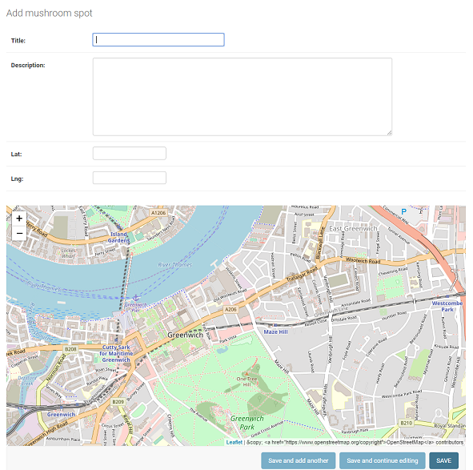

# django-leaflet-point

django-leaflet-point is a simple Django app inspired by the django-leaflet app that facilitates the addition of a Leaflet-map in admin.

Installation
-------------

To get the latest version, simply do::

    pip install django-leaflet-point

Quick start
------------

1. Add "leaflet_point" to your INSTALLED_APPS setting like this:

        INSTALLED_APPS = [
            ...
            'leaflet_point',
        ]

2. Make sure you have a model with latitude and longitude as decimals.

        latitude = models.DecimalField(max_digits=9, decimal_places=6, null=True)
        longitude = models.DecimalField(max_digits=9, decimal_places=6, null=True)

3. Import and register LeafletPoint in `YourApp/admin.py` like this:

        leaflet_point.admin import LeafletPointAdmin
        from django.contrib import admin
        from . import models

        admin.site.register(models.YourAppModel, LeafletPointAdmin) # don't forget to change to your model

    or if you'd like to customize admin:

        class CustomLeafletPointAdmin(LeafletPointAdmin):
            list_display = ('{title/name/...}', latitude', 'longitude')

        admin.site.register(
            models.YourAppModel, # don't forget to change to your model
            LeafletPointAdmin, 
            config_overrides = {
                'lat_input_selector': 'latitude', # if you want to name your field differently
                'lng_input_selector': 'longitude', # defaults to longitude and latitude
                'geocoder': True # defaults to false
            }   
        )

4. (Optional) Add LEAFLET_POINT_CONFIG to `settings.py` to override the defaults:

        LEAFLET_POINT_CONFIG = {
            # these are defaults...
            'map_height': 400,
            'tile_layer': 'https://{s}.tile.openstreetmap.org/{z}/{x}/{y}.png',
            'attibution': '&copy; <a href="https://www.openstreetmap.org/copyright">OpenStreetMap</a> contributors',
            'initial_lat': 51.4825766,
            'initial_lng': 0,
            'initial_zoom': 15,
            'geocoder': False
        }

4. Start the development server and visit http://127.0.0.1:8000/admin/  --> YourApp/YourAppModel

5. Voilá!

Vesions
-----------

Versions 0.1 & 0.2 were personal usage only. With 0.3 the code was made public.

#### 0.3.1

- First public relase

Based on
---------

 - Leaflet 1.4.0
 - Leaflet Control Geocoder 1.7.0

Screenshot
------------

From the Mushroom example found in `example/`

Todo
-------

No specific. However, on request:

 - Fix bugs
 - Add more functionality
 - Create and update docs (non-existing)

License
--------

 - MIT 

**Free Software, Hell Yeah!**